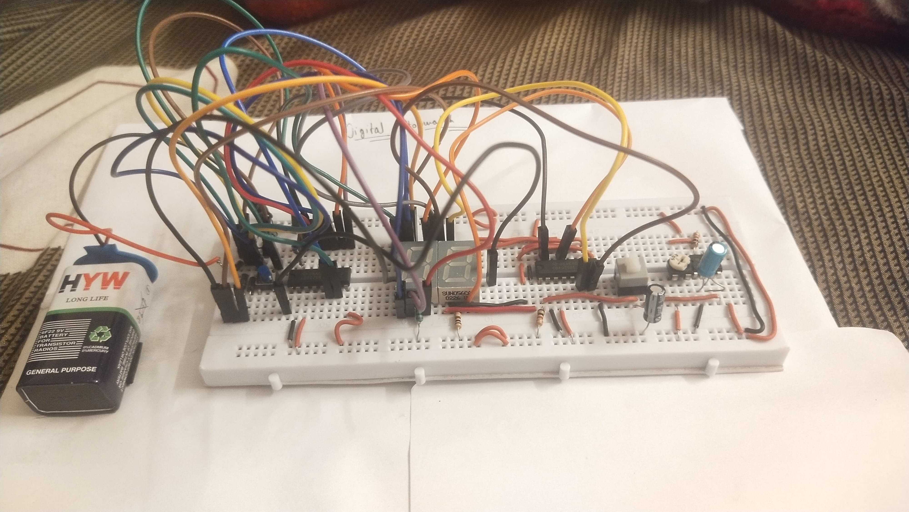

# Digital Stopwatch Project

This project focuses on designing and implementing a **Digital Stopwatch** using digital electronics. A digital stopwatch is an electronic device used for precise time measurement and is widely employed in sports, scientific experiments, and industrial applications. This project showcases the principles of binary counting, timekeeping, and digital display interfacing.

---

## Introduction

A Digital Stopwatch is an electronic device designed to measure time intervals with high precision. Unlike mechanical stopwatches, it uses digital components to provide an accurate time display. This project aims to build a stopwatch capable of measuring time up to 99 seconds with start, stop, and reset functionalities. The stopwatch relies on binary counters, flip-flops, and seven-segment displays, driven by a clock pulse generator.

Key features include:

- High-precision timekeeping up to 99 seconds.
- Start, Stop, and Reset controls.
- Display using seven-segment digital displays.

---

## Components Used

1. **CD4026 IC** (x2)
2. **555 Timer IC**
3. **7-Segment Display (Common Cathode)** (x2)
4. **Self-lock Switch**
5. **Push Button Switch**
6. **1N4007 Diode** (x3)
7. **50K Variable Resistor**
8. **1K Resistor** (x2)
9. **100K Resistor**
10. **100 Ohm Resistor**
11. **100uF Capacitor**
12. **1uF Capacitor**
13. **Breadboard**
14. **Connecting Wires**

---

## Working Principle

The Digital Stopwatch operates based on the principles of binary counting and clock pulse generation:

- **Binary Counting:** The binary counters increment the count with each clock pulse.
- **Display Conversion:** A BCD to 7-segment decoder drives the displays, converting binary counts into human-readable time.
- **Control Functions:** Push-button switches enable the start, stop, and reset functionalities.
- **Clock Signal:** A 555 Timer IC generates a consistent clock pulse to drive the counters, ensuring accurate timekeeping.

---

## Circuit Diagrams

### Breadboard Circuit

### Stopwatch Circuit Diagram

---

## Demonstration Video

- **Working Video:**
  

---

## Applications and Improvements

### Applications:

- Sports event timing.
- Scientific experiments requiring precise time intervals.
- Industrial process monitoring.

### Potential Improvements:

- Expand the timing range beyond 99 seconds.
- Add memory to store and recall time intervals.
- Implement a digital interface for external connectivity.

